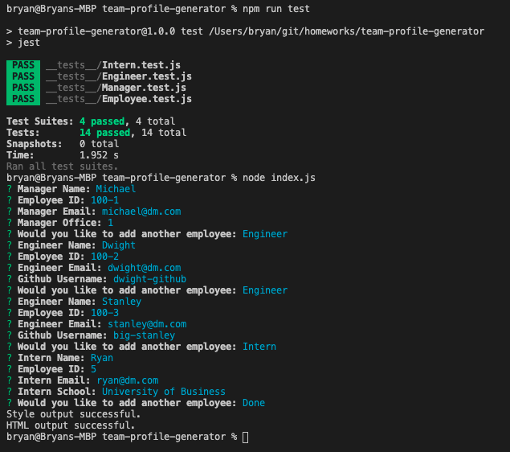
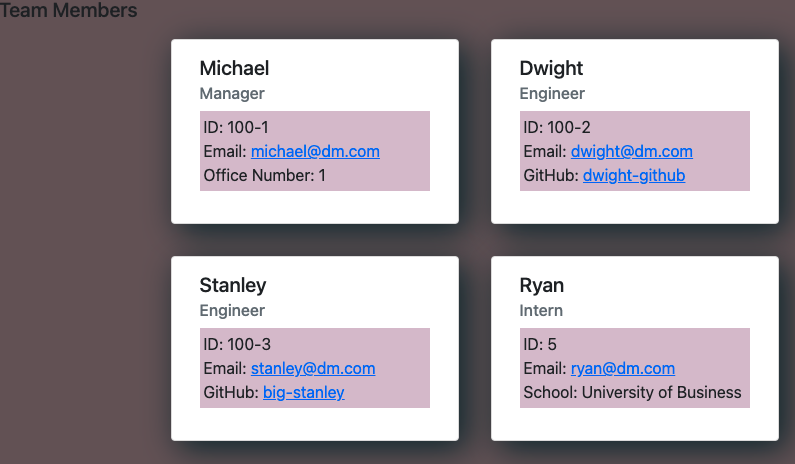

# Team Profile Generator

## Description
This project uses a node.js command line interface to create an html page displaying a team. The user can enter information in the cli that is then rendered to a webpage. 
## Table of Contents
- [Installation](#installation)
- [Usage](#usage)
- [Contributions](#contributions)
- [Testing Information](#testing)
- [License](#license)
- [Questions](#questions)
## Installation
To install enter npm install in the command line. This will install the required dependencies.
## Usage
To use the application enter node index.js in the command line and follow the prompts. You can find a video demonstration of the app [here](https://youtu.be/hvzoFUENlDc).

## Contributions

## Testing
To test, run 'npm test -- npm run test'.

## License
This project is covered under a/an MIT license. For more information see GitHub documentation on licensing a project [here](https://docs.github.com/en/communities/setting-up-your-project-for-healthy-contributions/adding-a-license-to-a-repository).

## Questions
​For questions, get in touch on [GitHub](https://github.com/bryan-barnes12/) or email me at [theonlysweetbeebles@gmail.com](mailto:theonlysweetbeebles@gmail.com).
    